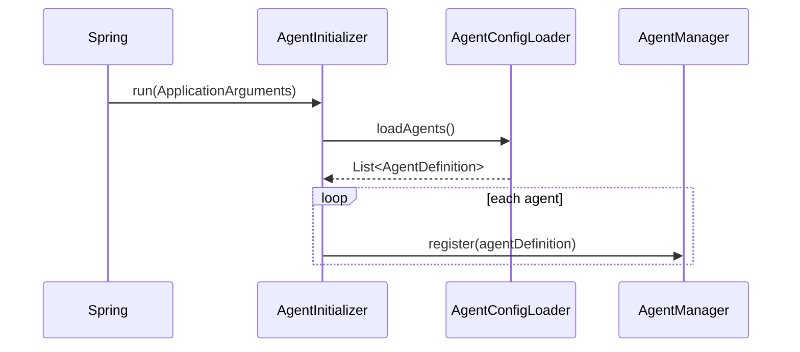
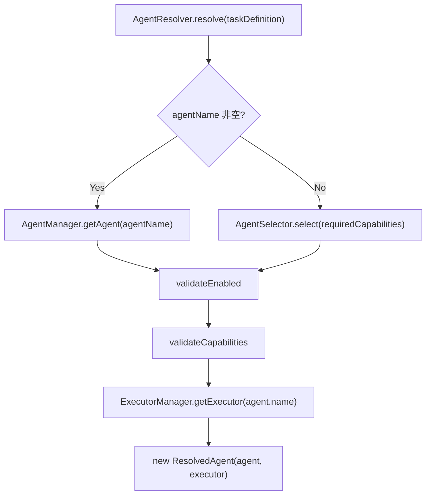
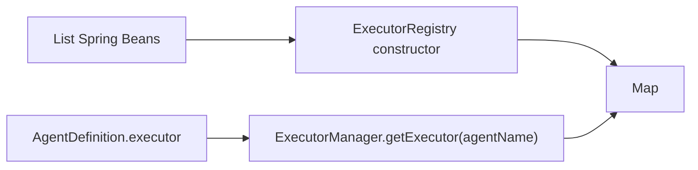

# 当前 Agent 系统

> 本文只描述当前代码中的 Agent 模型、注册、解析和 Executor 映射。

## 1. AgentDefinition

`com.aidevos.orchestrator.model.AgentDefinition` 是当前 Agent 配置模型。

| 字段 | 类型 | 当前用途 |
| --- | --- | --- |
| `name` | `String` | Agent 唯一查找键，也是 Task 显式选择值 |
| `executor` | `String` | Executor Registry 的类型键 |
| `executorConfig` | `Map<String,Object>` | 当前 Executor 专属参数容器 |
| `capabilities` | `List<String>` | capability 匹配和显式 Agent 校验 |
| `type` | `String` | 可由 YAML 加载并通过 Agent API 返回；未参与解析 |
| `description` | `String` | 展示性配置；未参与解析 |
| `permissionLevel` | `String` | 可加载和返回；未接入命令策略或解析 |
| `enabled` | `boolean` | `AgentResolver.validateEnabled` 校验，默认 true |

`getExternalId/setExternalId` 仍存在，但已标记为待移除的 deprecated 兼容方法；它们映射 `executorConfig.agentId`。当前生产配置和 `ExecutionEngine` 不再使用独立 externalId 字段。

## 2. Agent 注册



`AgentConfigLoader` 固定读取 classpath 根目录下的 `agents.yaml`。它校验：

- `agents` 必须是列表；
- 每项必须是 Map；
- name 非空且不重复；
- executor 非空；
- OpenClaw Agent 必须存在非空 `agentId`。

`AgentManager.register` 以 name 为键写入 `LinkedHashMap`；它本身不会拒绝重复名称，重复名称会覆盖旧值。YAML 路径的重复名称由 Loader 提前阻止。

## 3. AgentResolver



### 显式名称解析

当 `TaskDefinition.agentName` 非空时，Resolver 只按名称查找该 Agent。Agent 不存在、被禁用、缺少 required capabilities 或没有对应 Executor 时抛出 `AgentResolutionException`。

### Capability 解析

当 Task 没有 agentName 时，`AgentSelector.select` 遍历 `AgentManager.getAllAgents()`，返回第一个 capabilities 包含全部 required capabilities 的 Agent。

当前选择器本身不检查 enabled 或 Executor 是否存在；这些检查在选出 Agent 后由 Resolver 执行。required capabilities 为空时，Selector 返回 null。

## 4. Executor 映射



当前映射表由实现类决定：

| Executor type | 实现类 | 调用对象 |
| --- | --- | --- |
| `mock` | `MockAgentExecutor` | 无外部依赖，生成模拟结果 |
| `codex` | `CodexExecutor` | `CommandExecutor` |
| `openclaw` | `OpenClawExecutor` | `OpenClawTaskService` |

Registry 使用 `putIfAbsent`，同一 type 注册两个 Bean 会导致初始化失败。

## 5. Agent 配置方式

当前 YAML 结构是：通用字段位于 Agent 项一级，Executor 专属配置位于与 executor 同名的 Map 中。

```yaml
- name: browser-agent
  executor: openclaw
  openclaw:
    agentId: main
  capabilities:
    - browser
```

`AgentConfigLoader` 使用 `agent.get(agentDefinition.getExecutor())` 取得专属 Map，并保存为 `executorConfig`。`ExecutionEngine.createContext` 将其复制到 `ExecutionContext.parameters`；具体 Executor 再解释字段。

当前已使用的专属字段：

- OpenClaw：`agentId`。
- Codex：可选 `workspace`、`model`。
- Mock：无专属字段。

## 6. 当前配置的 Agent

依据 `src/main/resources/agents.yaml`：

| name | executor | capabilities | 当前实际含义 |
| --- | --- | --- | --- |
| `planner` | `mock` | `analysis` | 解析后只执行 Mock，不是外部 Planner |
| `executor` | `mock` | `coding`, `git` | 解析后只执行 Mock |
| `coder` | `codex` | `coding`, `git` | 执行本地 `codex exec`；workspace/model 当前配置为空 |
| `tester` | `openclaw` | `testing`, `browser` | 使用 OpenClaw agentId `main` |
| `browser-agent` | `openclaw` | `browser` | 使用 OpenClaw agentId `main` |

因此当前代码支持按名称或 capability 选择这些 Agent，但 `planner` 和名为 `executor` 的 Agent 仍是模拟执行。

## 7. Agent API

`GET /api/agents` 由 `AgentController.getAllAgents` 直接返回 `AgentManager.getAllAgents()`。当前没有创建、更新、删除、启停 Agent 的 HTTP API；`AgentManager` 虽提供 `removeAgent`，但没有 Controller 调用它。
