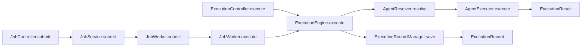
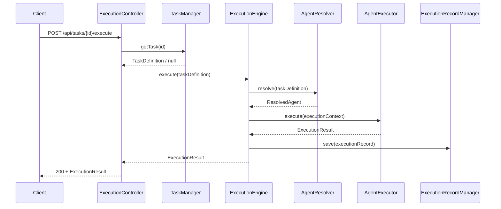
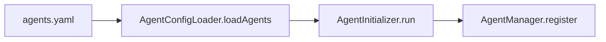
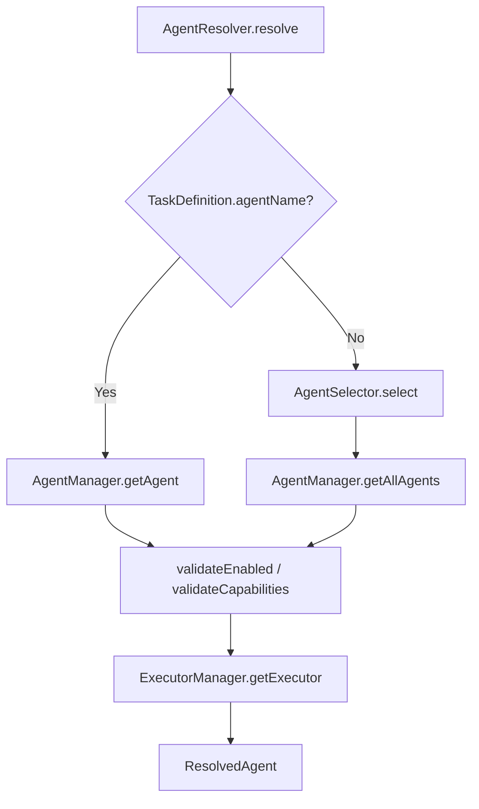
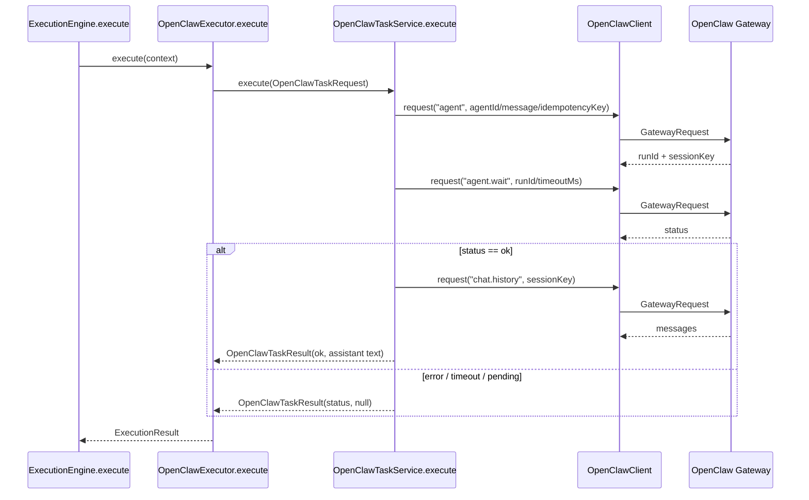

# AI Dev OS Orchestrator 当前架构

> 生成依据：当前工作区中的 `src/main`、`frontend/src`、`scripts` 和 `pom.xml`。本文描述代码已经实现的结构和调用关系，不代表目标架构。

## 1. 技术与部署结构

- 后端：Java 21、Spring Boot 4.0.0、Maven。
- 前端：Vue 3、TypeScript、Vite。
- 后端默认端口：`18080`。
- 前端开发端口：`15174`，通过 Vite 将 `/api` 代理到后端。
- OpenClaw 默认地址：`ws://127.0.0.1:18789`。
- 数据保存：Task、Job、ExecutionRecord 和 Schedule 注册信息均保存在进程内存中。

代码依据：`pom.xml`、`frontend/vite.config.ts`、`src/main/resources/application.properties`、`TaskManager`、`JobStore`、`ExecutionRecordManager`、`ScheduleService`。

## 2. 当前模块结构

| 模块 | 主要包或目录 | 当前职责 |
| --- | --- | --- |
| API | `controller` | Task、Job、Agent、ExecutionRecord、Schedule、Dashboard HTTP API |
| Task | `task`、`model/TaskDefinition` | JSON Task 加载、注册、查询、状态与通用 parameters 字段维护 |
| Job | `job` | Task 快照、内存队列、单 Worker 执行和 Job 状态维护 |
| Agent | `agent`、`manager/AgentManager` | Agent 注册、按名称或 capability 解析 |
| Executor | `executor` | Executor SPI、注册表、Mock/Codex/OpenClaw 实现 |
| Execution | `execution` | 上下文构造、Executor 调用、结果和执行记录 |
| OpenClaw | `openclaw` | Protocol v4 WebSocket 客户端、握手、请求关联和 Agent 调用适配 |
| Command | `executor/command` | 本地进程执行、命令策略和审批判断 |
| Git | `executor/git` | Git status/diff 命令封装；当前未接入 `ExecutionEngine` |
| Schedule | `schedule` | Cron 注册、触发和 Job 提交 |
| Dashboard | `dashboard` | Task、Job、ExecutionRecord 的内存统计聚合 |
| Frontend | `frontend/src` | Dashboard、Task、Job、Agent、Schedule 和执行记录页面 |
| 配置 | `src/main/resources` | Agent YAML、Task JSON、Spring/OpenClaw/Job 配置 |

## 3. 核心调用链

当前存在同步执行和异步 Job 执行两条入口，两者最终调用同一个 `ExecutionEngine.execute`。

同步入口直接返回 `ExecutionResult`。异步入口先返回 `JobSubmissionResponse`，客户端再通过 `/api/jobs/{id}` 查询 `ExecutionJob`。

## 4. Task 执行流程

### 4.1 Task 来源

Task 有两种注册来源：

1. `TaskLoader.run/loadTasks` 扫描 `classpath:/tasks/*.json`，反序列化为 `TaskDefinition` 后调用 `TaskManager.register`。
2. `POST /api/tasks` 由 `TaskController.register` 直接调用 `TaskManager.register`。

`TaskManager` 使用 `LinkedHashMap<String, TaskDefinition>` 保存 Task；相同 ID 会覆盖已有对象。Task 可通过可选 `parameters` Map 向执行链传递参数；异步 Job 创建 Task 快照时会递归复制 Map/List 参数。

### 4.2 同步执行

Task 不存在时返回 404。Agent 解析失败或 Executor 抛出 `Exception` 时，`ExecutionEngine` 构造失败 `ExecutionResult`，并继续保存 `FAILED` ExecutionRecord。

### 4.3 异步 Job 执行

`JobService.submit` 复制 Task 字段形成快照，创建 `ExecutionJob`，先保存到 `JobStore`，再通过 `JobWorker.submit` 放入有界队列。队列满时删除刚保存的 Job，并由 Controller 返回 HTTP 429。

`JobWorker` 使用单线程 `ExecutorService` 和 `ArrayBlockingQueue`。Worker 将 Job 标记为 RUNNING，通过 `ExecutionRecordManager.capture` 调用 `ExecutionEngine.execute`，取得本次保存的 ExecutionRecord ID，最后将 Job 标记为 SUCCESS 或 FAILED。

## 5. Agent 流程

启动阶段：

执行阶段：

显式 `agentName` 优先；没有名称时，Selector 按 Agent 注册顺序返回第一个包含全部 required capabilities 的 Agent。

## 6. Executor 流程

`AgentExecutor` 当前定义两个方法：`getType()` 和同步的 `execute(ExecutionContext)`。

Spring 将全部 `AgentExecutor` Bean 注入 `ExecutorRegistry`。Registry 以 `getType()` 返回值为键，重复键会抛出 `IllegalStateException`。`ExecutorManager` 先按 Agent 名称取得 `AgentDefinition.executor`，再从 Registry 取得实现。

当前实现：

- `MockAgentExecutor`：返回模拟文本。
- `CodexExecutor`：通过 `CommandExecutor` 执行 `codex exec`，可读取 `workspace` 和 `model` 参数。
- `OpenClawExecutor`：读取 `agentId` 参数并调用 `OpenClawTaskService`；当参数包含 `browser` Map 时，通过 `BrowserTaskPromptBuilder` 构造 browser tool 指令，并由 `BrowserResultMapper` 将约定 JSON 结果中的截图等条目映射为 `ExecutionArtifact`。非 Browser Task 保持原有文本调用和结果映射。

`ExecutionEngine.createContext` 当前填充 Task/Agent 文本字段、进程工作目录、Task parameters 和 Agent executorConfig；`executionId`、`jobId`、`metadata` 当前没有在该方法中赋值。

Task parameters 会先写入 `ExecutionContext.parameters`，随后叠加 Agent executorConfig，因此 Task 不能覆盖 `agentId` 等 Executor 配置。

### 6.1 Browser Task 参数边界

Browser Task 复用 OpenClaw Executor，不存在独立 BrowserExecutor。参数位于 `parameters.browser`，当前支持 `navigate`、`snapshot`、`click`、`input`、`screenshot` 和 `assert` action；URL、定位信息、输入值、断言和截图选项作为该 Map 的附加字段透传到确定性 Agent 指令。

Browser Agent 被要求只通过已有 browser tool 执行，并以 `output` 与 `artifacts` 组成的 JSON 对象返回最终结果。无法解析该对象时，Executor 保留原始 assistant 文本并返回空 Artifact 列表，以兼容现有 OpenClaw Agent 行为。

真实环境已通过 `POST /api/tasks/openclaw-test/execute` 验证该链路：OpenClaw `main` Agent 导航到 `https://example.com`，确认标题 `Example Domain`，生成 PNG 截图，并由 Orchestrator 映射为 `type=screenshot`、`mediaType=image/png` 的 `ExecutionArtifact`。

## 7. OpenClaw 调用流程

`OpenClawWebSocketClient.connect` 建立 WebSocket，收到 `connect.challenge` 后由 `sendConnectRequest` 发送 Protocol v4 connect 请求。连接请求包含 operator role、read/write scopes、token 和设备签名。普通 Gateway 请求通过 UUID 关联 `pendingRequests`，并受 request timeout 控制。

## 8. 当前存储与生命周期

- Task：`TaskManager` 内存 Map。
- Agent：`AgentManager` 内存 `LinkedHashMap`。
- Job：`JobStore` 内存 `ConcurrentHashMap`。
- ExecutionRecord：`ExecutionRecordManager` 内存 `LinkedHashMap`。
- Schedule：`ScheduleService` 内存 Map，调度句柄在 `TaskScheduler` 内存 Map。
- OpenClaw device identity：`OpenClawDeviceIdentityStore` 使用配置路径中的本地 JSON 文件。

应用重启后，除 classpath Task、YAML Agent、Spring 配置的 Schedule 和设备 identity 外，运行时创建的 Task、Job、ExecutionRecord 和 Schedule 注册信息不会由代码自动恢复。
