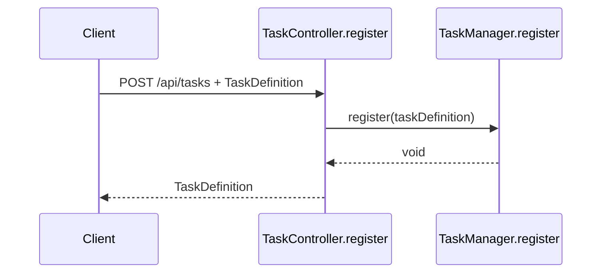
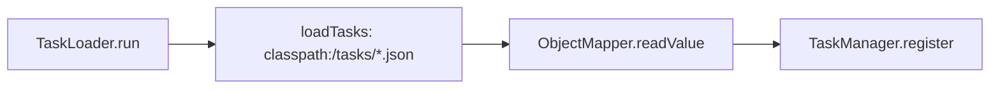
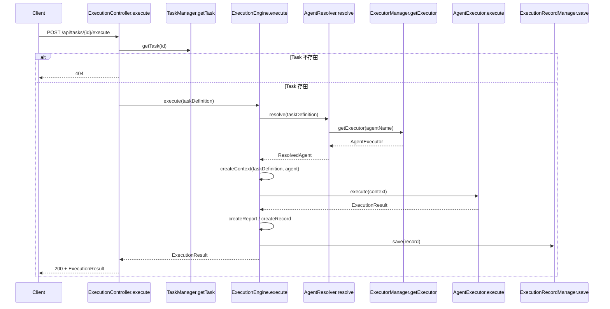
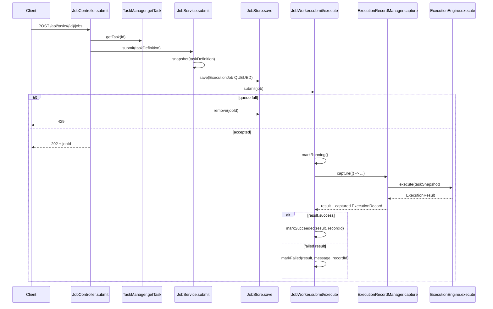
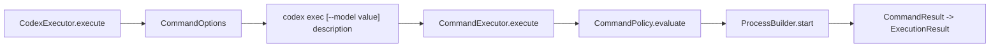

# 当前执行流程

> 本文从 HTTP API 到结果返回逐步描述当前实现。代码中 Task 创建、同步执行和 Job 提交是独立操作，并非一次请求内自动连续发生。

## 1. API 入口

| 操作 | API | Controller 方法 | 返回 |
| --- | --- | --- | --- |
| 创建/覆盖 Task | `POST /api/tasks` | `TaskController.register` | `TaskDefinition` |
| 查询 Task | `GET /api/tasks` | `TaskController.getAllTasks` | Task 列表 |
| 同步执行 Task | `POST /api/tasks/{id}/execute` | `ExecutionController.execute` | `ExecutionResult` |
| 提交 Job | `POST /api/tasks/{id}/jobs` | `JobController.submit` | HTTP 202 + `JobSubmissionResponse` |
| 查询单个 Job | `GET /api/jobs/{id}` | `JobController.get` | `ExecutionJob` |
| 查询 Job | `GET /api/jobs?status=...` | `JobController.getAll` | Job 列表 |
| 查询执行记录 | `GET /api/execution-records` | `ExecutionRecordController.getAll` | 摘要列表 |
| 查询记录详情 | `GET /api/execution-records/{id}` | `ExecutionRecordController.get` | 记录详情 |

## 2. Task 创建与加载

### HTTP 创建

Controller 当前没有 Bean Validation。`TaskManager.register` 使用 `taskDefinition.id` 作为 Map 键；相同 ID 会覆盖旧 Task。

### 启动加载

单个 JSON 加载失败时记录错误日志并继续加载其他资源。

## 3. 同步执行全链路

### ExecutionContext 构造

`ExecutionEngine.createContext` 当前写入：

- taskId、taskName、description；
- agentName；
- input，值等于 Task description；
- workspace，值为 JVM `user.dir`；
- parameters，值为 Agent executorConfig 的副本。

模型中的 executionId、jobId、metadata 和 externalAgentId 当前没有在该执行路径赋值。

### 异常处理

- `AgentResolutionException` 转换为失败 `ExecutionResult`。
- `AgentExecutor.execute` 抛出的 `Exception` 转换为失败 `ExecutionResult`，message 形式为 `Executor {type} failed: {detail}`。
- 上述失败仍会执行 `ExecutionRecordManager.save`。
- `Error`、记录保存异常以及 Engine 其他未捕获异常仍可能向调用方传播。

## 4. 异步 Job 全链路

Job 快照复制 Task 的 id、name、description、agentName、requiredCapabilities 和 status。JobWorker 当前是单线程，队列容量默认 100，可通过 `execution.jobs.capacity` 配置。

Worker 最外层捕获 `Throwable`；这类失败会标记 Job FAILED，但如果异常发生在 ExecutionRecord 保存前，Job 可能没有 executionRecordId。

## 5. Agent 解析

`AgentResolver.resolve` 的顺序：

1. 若 Task 指定 agentName，调用 `AgentManager.getAgent`。
2. 否则调用 `AgentSelector.select(requiredCapabilities)`。
3. 校验 enabled。
4. 校验 Agent 包含 Task 的全部 required capabilities。
5. 调用 `ExecutorManager.getExecutor(agent.name)`。
6. 返回 `ResolvedAgent(AgentDefinition, AgentExecutor)`。

## 6. Executor 调用

### Mock

`MockAgentExecutor.execute` 直接构造成功结果，output 包含 Task ID 和 description。

### Codex

命令策略支持 ALLOW、DENY、REQUIRE_APPROVAL；默认配置中 `command.policy.enabled=false`，因此当前默认允许命令。`ApprovalGate` 参与 REQUIRE_APPROVAL 判断，但代码中没有用户交互式审批 API。

### OpenClaw

`OpenClawExecutor` 将 parameters.agentId 和 input 转为 `OpenClawTaskRequest`，调用异步 Service 后用 `join()` 同步等待。Service 依次调用 Gateway 的 `agent`、`agent.wait`，成功后调用 `chat.history` 并提取最后一个非空 assistant 文本。

## 7. Result 与记录返回

`ExecutionResult` 当前包含：

- success；
- message；
- output；
- artifacts。

`ExecutionArtifact` 已定义 type、name、mediaType、uri、content 和 metadata，但当前三个 Executor 都没有创建 Artifact。

`ExecutionEngine` 将结果复制到 `ExecutionReport` 和 `ExecutionRecord`。`ExecutionReport` 仍有 beforeGitStatus/afterGitDiff 字段，但 Engine 当前不赋值。ExecutionRecord 保存于内存，详情 API 返回 output 和 report。
